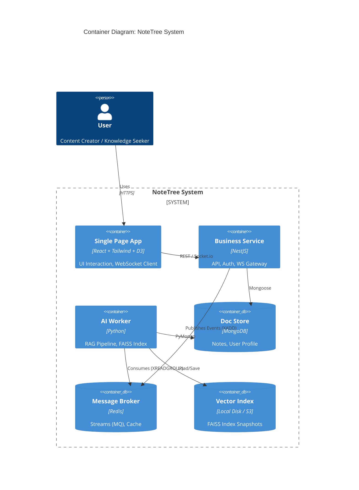
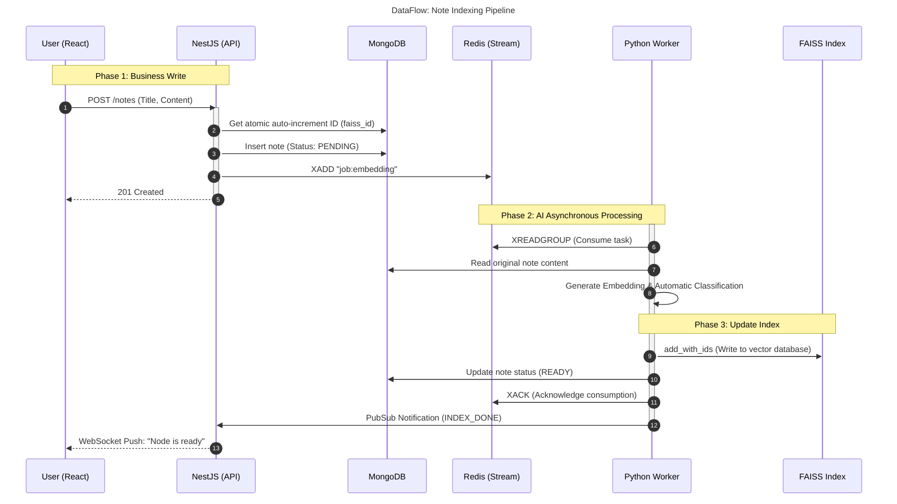
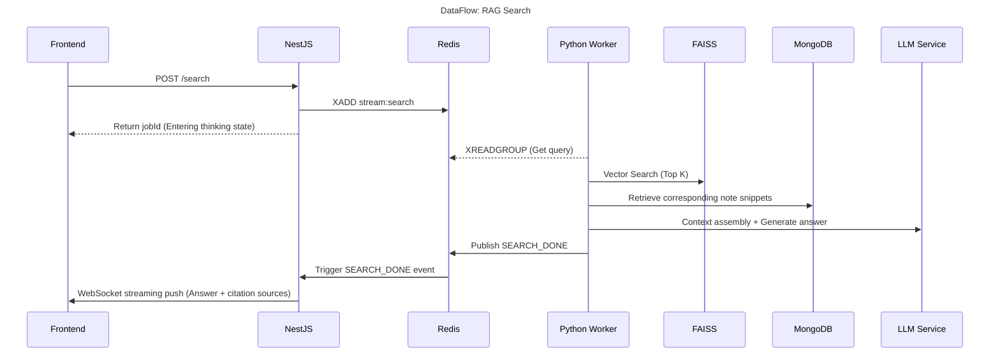

<div align="center">

# NoteTree 🌳

**Bring your notes to life: An AI and visualization-based personal knowledge base system**

[](LICENSE)


[Features](#-Features) •
[Core Architecture](#-Core-Architecture) •
[Quick Start](#-Quick-Start) •
[Development Guide](#-Development-Guide)

---

</div>

## 📖 Introduction

**NoteTree** aims to solve the problem of having a large number of personal notes that are "stored but not easily retrieved." It's not just a note-taking tool, but an intelligent knowledge gardener.

Through **RAG (Retrieval Augmented Generation)** technology and **D3.js visualized knowledge trees**, NoteTree transforms fragmented Markdown notes into a structured knowledge graph, allowing you to both overview the knowledge network and perform precise, granular searches using natural language.

## ✨ Features

- 🕸️ **Visualized Knowledge Tree**: Abandon traditional folders and display note relationships with a dynamically growing tree diagram.
- 🤖 **AI Smart Q&A (RAG)**: Query your note library like talking to a person, supporting contextual relevance.
- ⚡ **Event-Driven Architecture**: Based on Redis Streams, achieving perfect decoupling of millisecond-level response and asynchronous AI inference.
- 🐳 **One-Click Deployment**: Complete Docker Compose orchestration, ready to use out of the box.
- 🔍 **Hybrid Retrieval**: Combining full-text search and FAISS vector search for maximum recall. ## 🏗 Core Architecture

NoteTree employs an **event-driven architecture**, ensuring complete decoupling and scalable flexibility between the business logic (Node.js/NestJS) and AI-intensive computations (Python). ### 🛠 Technology Stack

| Area           | Technology Selection     | Function                                              |
| :------------- | :----------------------- | :---------------------------------------------------- |
| **Frontend**   | React, Tailwind, D3.js   | UI Interaction, SVG Rendering, WebSocket Client       |
| **Backend**    | NestJS (Node.js)         | API Gateway, Authentication (RBAC), Business Logic    |
| **AI Worker**  | Python (FastAPI Runtime) | RAG Pipeline, Embedding, LLM Inference                |
| **Data Store** | MongoDB, Redis, FAISS    | Document Storage, Message Queue & Cache, Vector Index |

### 📐 System Context (C4 Context)



---

## 🔄 Data Flow and Logic

### 1. Note Indexing Process (Write Path)

When a user uploads a note, the system uses Redis Stream for asynchronous decoupling, enabling "instant response, background processing".



### 2. RAG Search Process (Read Path)

After the user asks a question, the Python Worker retrieves data from the vector database and document database in parallel, constructs a prompt, and sends it to the LLM to generate an answer.



---

## 🚀 Quick Start

This project only supports **Docker Compose** for local development orchestration, which is the simplest way to get started.

### Prerequisites

- [Docker Desktop](https://www.docker.com/products/docker-desktop) (v20.10+)
- Ollama API

### Startup Steps

1.  **Clone the repository**

```bash
git clone https://github.com/Chenghao-Wen/NoteTree
cd notetree
```

2.  **Environment Configuration**
    Copy `.env.example` and fill in the necessary API Key.

```bash
cp .env.example .env
# Open .env with a text editor and fill in OPENAI_API_KEY
```

3.  **Start the cluster**

```bash
docker-compose up -d --build
```
